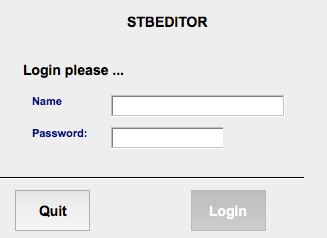
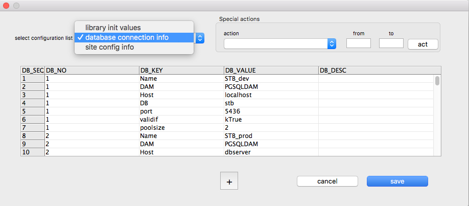
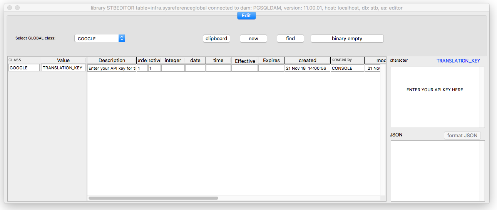

# omnis-stbeditor

STBEDITOR.lbs is an [Omnis Studio](http://www.omnis.net) library and PostgreSQL database to store the Omnis string table entries for all your applications.  The library includes an interface to the Google Translate API so basic translations can be obtained for your string tables.

The database entries can be extracted to create an in-memory string table when your application starts up by including a call to the method $buildStringTable, which can be copied from the task class tkSuper.

## Dependencies
Omnis Studio version 8.1 or later.

STBEDITOR requires a PostgreSQL database to store the string table entries in.  The database can be created from [stb.sql](db/stb.sql) [^note1] but will require that your Postgres instance has the following two group roles created first: 
[^note1]: The database includes the entries for the [CONFERENCE app](https://github.com/PISL/omnis-conference) to get you started.

1. "_developer" which owns the objects and 
2. "regular" which must be granted to the login role you wish to use to connect from Omnis.

## Installation
Clone this repository.

Copy [stbeditor.lbs](lib/STBEDITOR.lbs) to a directory of your choice or open Omnis and [Import from JSON](src/STBEDITOR).

Copy the SQLite initialisation DB [STBEDITOR.libini](lib/STBEDITOR.libini) to the same directory as the library.

Create the stb database from the stb.sql script (replacing dBserver/port/tq2dbToConnectTo/userName with your own values):

`psql -h dbServer -p port -d dbToConnectTo -U userName -a -f /path/to/stb.sql`

## Usage

1. Open stbeditor.lbs, and a login window will open to allow you to choose your database connection.

2. Hold down the shift key and click the Quit button.
3. This will take you to the init configuration editor.

4. Select "database connection info" from the drop list
5. Enter your Postgres server parameters: Host and port.  (The "validif" value is used in an Omnis eval() to decide if this connection can be used.  If you enter multiple databases and more than one "validif" evaluates to kTrue, the login window will display them in a drop list to be selected by the user.)
6. Save your changes and close the library.
7. Reopen the library and you should be able to connect to your stb database.

## Note
The editor includes an object class, oTranslate, which interfaces to Google's Translation API.  To use this functionality, an API key must be obtained from [Google](https://console.cloud.google.com/freetrial?page=0) and entered in the global reference table.

1. Select "reference global" from the String Table Editor menu.
2. Select GOOGLE from the class drop list.
3. Select the TRANSLATION_KEY line and enter your API key in the character box to the right.  The change will save when you close the window.

